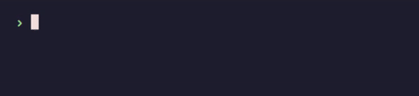
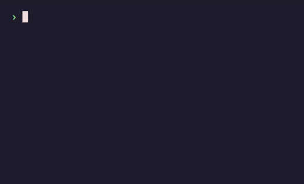
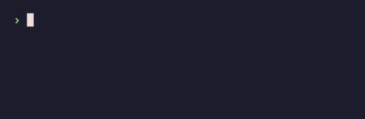

# Asky

> Ansi + ask + yes = Asky

Good looking prompts for the terminal (and maybe beyond).

## Usage

First of all, this is a library, so you need to add this to your project:

```bash
cargo add asky
```

Then, you can [see the documentation](https://docs.rs/asky/).

## Demos

### Confirm


<details>
<summary>Code:</summary>

```rust
use asky::Confirm;

fn main() -> std::io::Result<()> {
    if Confirm::new("Do you like coffe?").prompt()? {
        println!("Great, me too!");
    }

    // ...

    Ok(())
}

```

</details>

### Toggle


<details>
<summary>Code:</summary>

```rust
use asky::Toggle;

fn main() -> std::io::Result<()> {
    let tabs = Toggle::new("Which is better?", ["Tabs", "Spaces"]).prompt()?;
    println!("Great choice");

    // ...

    Ok(())
}
```

</details>

### Text


<details>
<summary>Code:</summary>

```rust
use asky::Text;

fn main() -> std::io::Result<()> {
    let color = Text::new("What's your favorite color?").prompt()?;
    println!("{color} is a beautiful color");

    // ...

    Ok(())
}
```

</details>

### Number



<details>
<summary>Code:</summary>

```rust
use asky::Number;

fn main() -> std::io::Result<()> {
    if let Ok(age) = Number::<u8>::new("How old are you?").prompt()? {
        if age <= 60 {
            println!("Pretty young");
        }
    }

    // ...

    Ok(())
}
```

</details>

### Password


<details>
<summary>Code:</summary>

```rust
use asky::Password;

fn main() -> std::io::Result<()> {
    let password = Password::new("What's your IG password?").prompt()?;

    if password.len() >= 1 {
        println!("Ultra secure!");
    }

    // ...

    Ok(())
}
```

</details>

### Select



<details>
<summary>Code:</summary>

```rust
use asky::Select;

fn main() -> std::io::Result<()> {
    let choice = Select::new("Choose number", 1..=30).prompt()?;
    println!("{choice}, Interesting choice");

    // ...

    Ok(())
}

```

</details>

### MultiSelect



<details>
<summary>Code:</summary>

```rust
use asky::MultiSelect;

fn main() -> std::io::Result<()> {
    let opts = ["Dog", "Cat", "Fish", "Bird", "Other"];
    let choices = MultiSelect::new("What kind of pets do you have?", opts).prompt()?;

    if choices.len() > 2 {
        println!("So you love pets");
    }

    // ...

    Ok(())
}

```

</details>

## Bevy Support

There is experimental support for [bevy](https://bevyengine.org), a rust game engine.

### Examples

One can use Asky with bevy in two ways: directly and using async.

#### Confirm Async

```sh
cargo run --features bevy --example bevy-confirm-async
```


```sh
cargo run --features bevy --example bevy-funny
```

## Mentions

Inspired by:

- [Prompts](https://www.npmjs.com/package/prompts) - Lightweight, beautiful and user-friendly interactive prompts
- [Astro](https://astro.build/) - All-in-one web framework with a beautiful command line tool
- [Gum](https://github.com/charmbracelet/gum) - A tool for glamorous shell scripts

Alternatives:

- [Dialoguer](https://github.com/console-rs/dialoguer) - A command line prompting library.
- [Inquire](https://github.com/mikaelmello/inquire) - A library for building interactive prompts on terminals.
- [Requestty](https://github.com/Lutetium-Vanadium/requestty) - An easy-to-use collection of interactive cli prompts.

---

License: [MIT](LICENSE)
